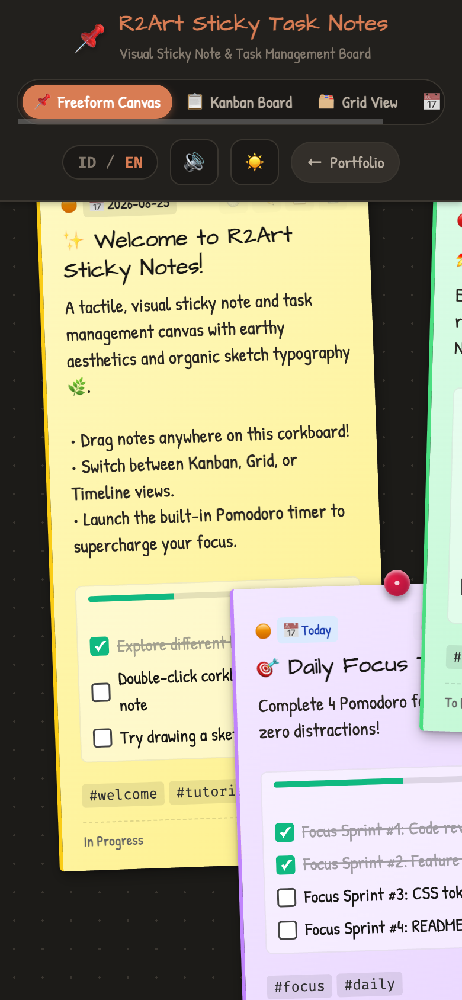
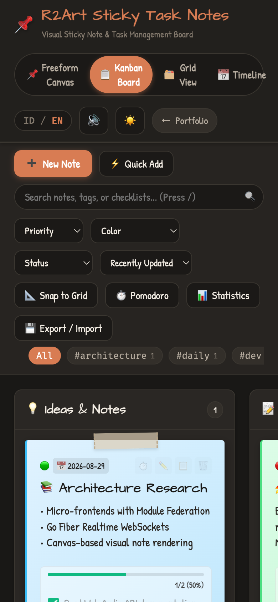
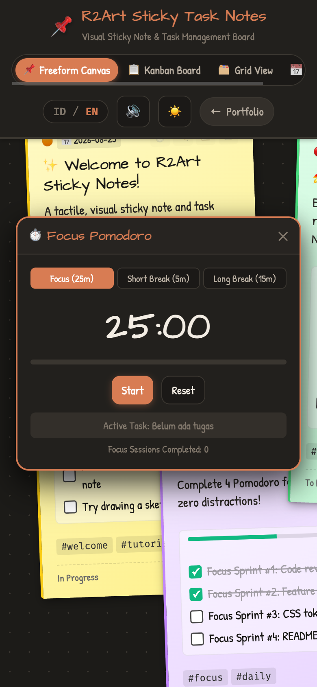
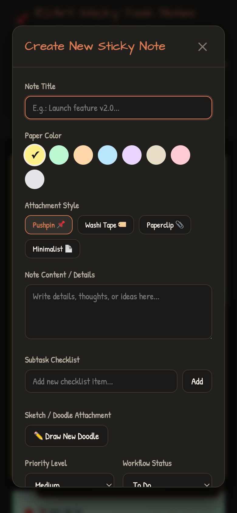
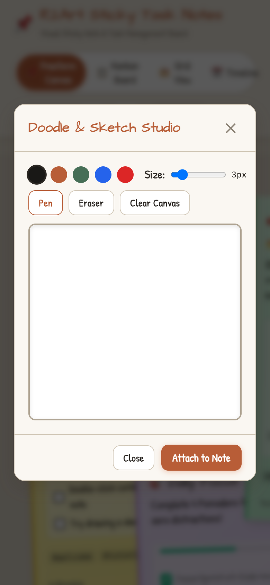
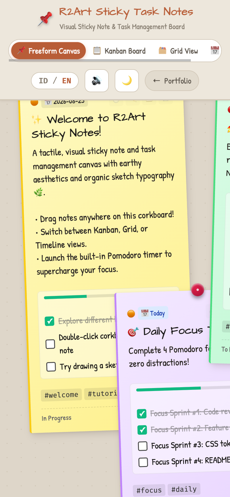

# 📌 R2Art Sticky Task Notes

[](#-design--aesthetics)
[](#-design--aesthetics)
[](#-internationalization)
[](#-tech-stack)

A tactile, aesthetic visual sticky note workspace and agile task management web application designed with realistic paper textures, organic handwriting typography, and rich productivity tooling.

---

## 📱 Mobile Responsiveness Previews

Tested and optimized for mobile screens (iOS & Android touch viewports) with fluid layouts, tactile touch gestures, and collapsible overlays:

| 📌 Corkboard View | 📋 Kanban Board | ⏱️ Pomodoro Timer |
| :---: | :---: | :---: |
|  |  |  |

| 📝 Note Editor | 🎨 Doodle Studio | ☀️ Light Theme |
| :---: | :---: | :---: |
|  |  |  |


---

## 🌟 Key Features

### 1. 📌 Multiple Dynamic Board Views
- **Freeform Corkboard / Canvas**: Drag & drop sticky notes freely across an expansive spatial board with realistic rotation angles, pushpins, washi tapes, and layer z-index control.
- **Kanban Agile Workflow Board**: 4 Status columns (*Ideas / Backlog*, *To Do*, *In Progress*, *Done*) with seamless drag-and-drop between columns.
- **Grid / Masonry View**: Clean structured card matrix sorted by date, priority, or color.
- **Timeline / Schedule View**: Automatic chronological grouping (*Overdue*, *Today*, *This Week*, *Later*, and *No Due Date*).

### 2. 📝 Rich Sticky Note Engine
- **8 Earthy Pastel Palettes**: Lemon Yellow, Matcha Sage, Warm Terracotta, Slate Sky, Lavender Clay, Kraft Sand, Rose Coral, and Cloud Gray.
- **Interactive Checklist Subtasks**: Live checkboxes with dynamic progress percentage bars (e.g. `3/5 (60%) done`).
- **Attachment Accents**: Pushpin 📌, Washi Tape 🏷️, Paperclip 📎, or Minimalist 📄.
- **Doodle & Sketch Studio**: Integrated HTML5 Canvas drawing tool to draw sketches directly onto sticky notes.
- **Priority & Due Date**: Categorize by *Urgent*, *High*, *Medium*, or *Low* with visual overdue warning pulses.
- **Tags & Labels**: Real-time filtering chips and tag indexing (`#dev`, `#flutter`, `#design`, `#urgent`).

### 3. ⏱️ Focus & Productivity Tools
- **Sticky Pomodoro Focus Timer**: 25m Work, 5m Short Break, and 15m Long Break intervals with task linking and session counter.
- **Procedural Web Audio Effects**: Realistic synthesized paper rustles, pin thuds, check chimes, and timer bells (100% self-contained, zero audio asset downloads).
- **Productivity Analytics Modal**: Instant breakdown of total notes, completion rates, checklist statistics, and top tags.

### 4. 💾 Portability & Offline-First
- **Automatic LocalStorage Sync**: Never lose your notes.
- **Export Options**:
  - Download full JSON Backup.
  - Export notes as clean Markdown (`.md`).
  - High-Resolution PNG Board Snapshot generator.
- **Restore & Import**: Easily import backup JSON files.

---

## ⌨️ Keyboard Shortcuts

| Shortcut | Action |
| :--- | :--- |
| <kbd>N</kbd> | Create new sticky note |
| <kbd>/</kbd> | Focus search bar |
| <kbd>T</kbd> | Toggle Pomodoro Focus Timer |
| <kbd>Esc</kbd> | Close active modal / cancel |

---

## 🎨 Design & Aesthetics

| Specification | Details |
| :--- | :--- |
| **Color System** | Earthy / Neutral Palettes (Terracotta `#b85d37`, Sage `#466e56`, Sand `#ded6c9`, Roasted Shale `#191816`) |
| **Typography** | `Architects Daughter` (Headings), `Patrick Hand` (Body & Notes), `Fira Code` (Tags & Code) |
| **Themes** | Earthy Dark Mode & Earthy Light Mode toggle |
| **Audio** | Procedural Web Audio API sound synthesis |

---

## 🚀 Running Locally

This project requires **zero build steps or heavy dependencies**. Open `index.html` directly in any modern browser or run a lightweight local static server:

```bash
# Using Python 3
python3 -m http.server 3000

# or using npx serve
npx serve .
```

Navigate to [http://localhost:3000](http://localhost:3000) in your browser.

---

## 📁 Architecture & File Structure

```
r2art_sticky_task_notes/
├── index.html              # Main application shell & dialogs
├── css/
│   ├── main.css            # Base design tokens, typography, layout & navbar
│   ├── sticky.css          # Sticky note cards, pins, tapes, kanban & timeline styles
│   └── components.css      # Modals, doodle canvas, pomodoro timer & toasts
├── js/
│   ├── i18n.js             # English & Bahasa Indonesia translation dictionary
│   ├── audio.js            # Procedural Web Audio API sound effects
│   ├── storage.js          # LocalStorage CRUD, default starter notes & JSON/MD exporter
│   ├── doodle.js           # HTML5 Canvas sketch & drawing engine
│   ├── timer.js            # Pomodoro focus timer widget
│   ├── notes.js            # Note model, rendering engine & checklist handlers
│   ├── board.js            # Corkboard drag-and-drop, Kanban, Grid & Timeline layouts
│   └── app.js              # Application orchestrator, keyboard shortcuts & PNG exporter
└── README.md               # Documentation & usage guide
```

---

## 👤 Author

**Rahmad Mukminullah (NaturalizerINA)**
- Portfolio: [https://naturalizerina.github.io](https://naturalizerina.github.io)
- GitHub: [@NaturalizerINA](https://github.com/NaturalizerINA)

---

## 📄 License

MIT License © 2026 Rahmad Mukminullah.
